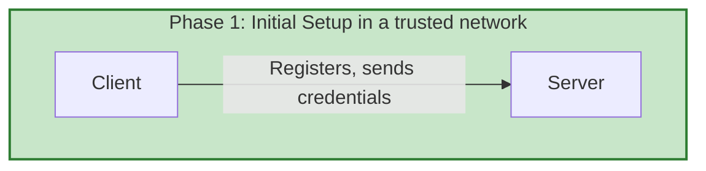

```mermaid
flowchart TB
    subgraph phase1 [Phase 1: Initial Setup in a trusted network]
        client[Client]
        server[Server]
        
        client -->|Registers, sends credentials| server
    end
    classDef trusted fill:#c8e6c9,stroke:#2e7d32,stroke-width:2px
    class phase1 trusted
```