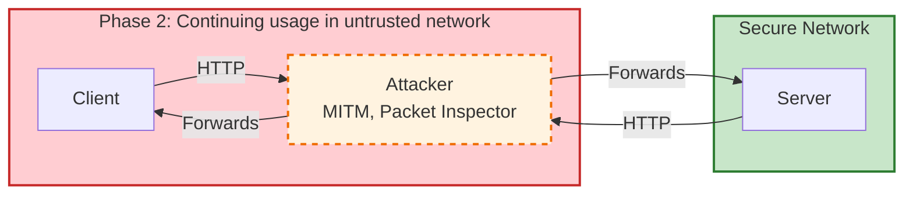

```mermaid
flowchart LR
    subgraph untrusted_zone [Phase 2: Continuing usage in untrusted network]
        client[Client]
        attacker[Attacker\nMITM, Packet Inspector]
    end

    subgraph trusted_zone [Secure Network]
        server[Server]
    end

    client -->|HTTP| attacker
    attacker -->|Forwards| server
    server -->|HTTP| attacker
    attacker -->|Forwards| client

    classDef untrusted fill:#ffcdd2,stroke:#c62828,stroke-width:2px
    classDef trusted fill:#c8e6c9,stroke:#2e7d32,stroke-width:2px
    classDef attacker fill:#fff3e0,stroke:#ef6c00,stroke-width:2px,stroke-dasharray: 5 5
    
    class untrusted_zone untrusted
    class trusted_zone trusted
    class attacker attacker
```