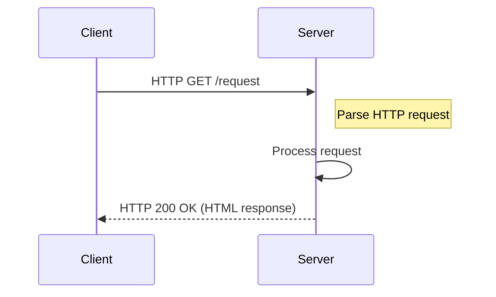

```mermaid
sequenceDiagram
    participant C as Client
    participant S as Server

    C->>S: HTTP GET /request
    Note right of S: Parse HTTP request
    S->>S: Process request
    S-->>C: HTTP 200 OK (HTML response)
```